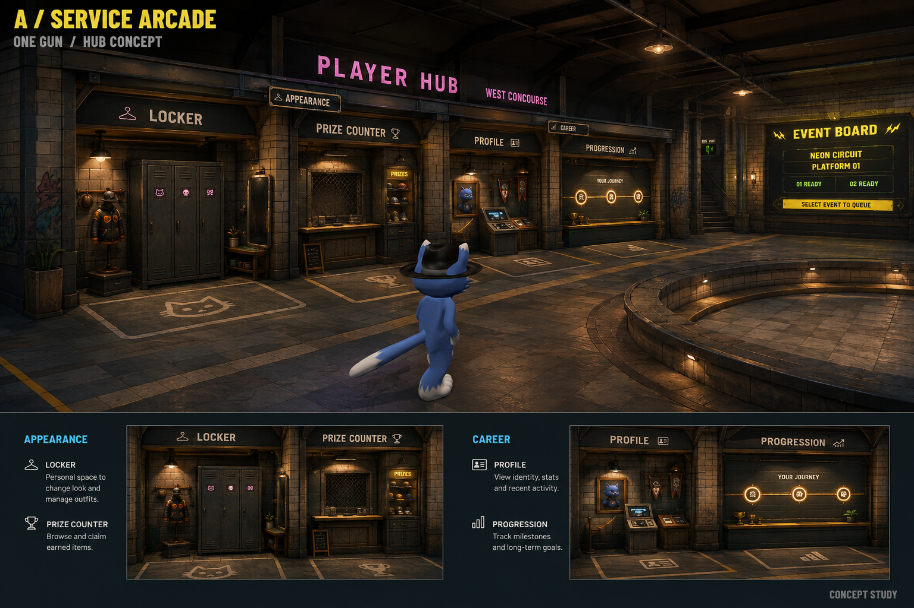
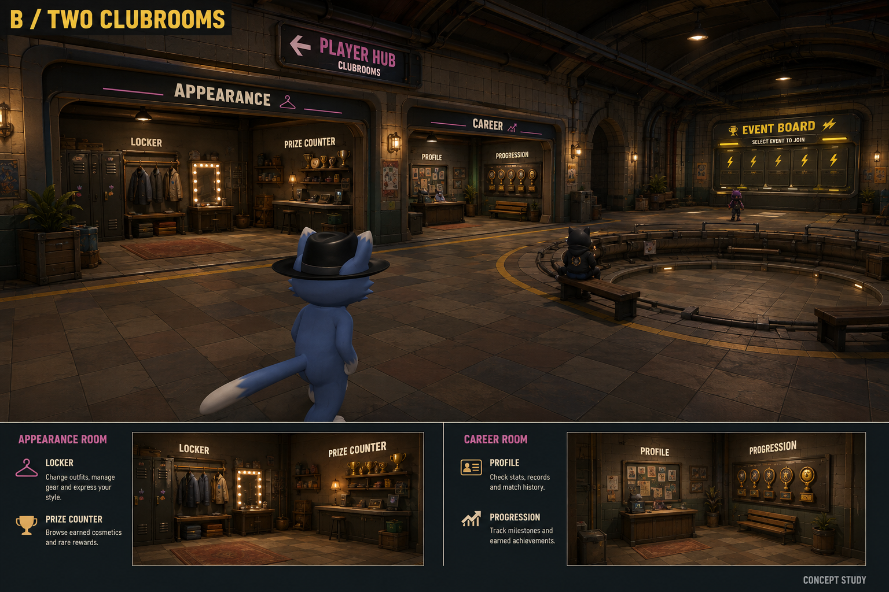
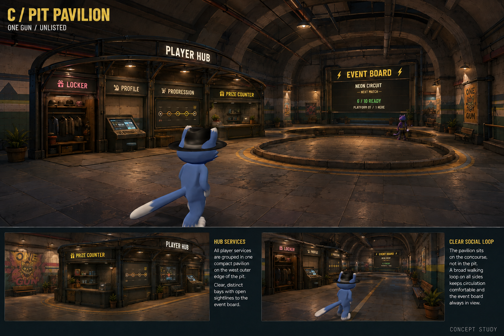

# One Gun — kiosk organization concepts

> The F6 implementation has since expanded Player Hub across the full west wall,
> suspended its sign from the ceiling, matched Party/Events to its materials,
> and replaced the movement course with a contained walk-in Play Pen beyond the
> firing-range hall. The images below document the earlier layout proposals;
> current Godot renders and validation are under `../artifacts/` and `../VALIDATION.md`.

Design study, 2026-09-05. These are proposals for the existing F6 preview, not
screenshots of implemented changes. The user subsequently approved A
(Service Arcade) with B's clubhouse details; that layout is now implemented in
`../live_lobby_preview.tscn`. Actual player-camera captures and measured checks
are under `../artifacts/` and documented in `../VALIDATION.md`. Menu/match
connections remain absent.

## Recommendation: Service Arcade

Give Player Hub one architectural address on the west concourse. Recess its four
services into a continuous arcade, sharing the same canopy, pilasters, lighting
and floor apron. Let each bay have a different silhouette and purpose.

The original kiosks relied heavily on similarly sized dark cabinets and bright
text. Their functions were readable, but they competed for attention and did not
feel like parts of a deliberately organized place. Repeated large descriptions
also compete with the main event board. Organization should come from the
building, props and hierarchy before adding more signage.

From arrivals, players should recognize four destinations: Events, Player Hub,
Practice and Departures. Inside Player Hub, they should recognize its four
services. At the selected service, they should see one action prompt. Keep H as
the immediate route to all four screens and keep the ready check accessible
everywhere.

## Three spatial directions

| Direction | Organization | Strength | Tradeoff |
|---|---|---|---|
| A — Service Arcade | Four recessed bays under one frontage; Appearance and Career form two adjacent pairs | Strongest clarity, easiest reuse of the current room, predictable navigation | Needs varied bay silhouettes and personal details to avoid a generic service counter |
| B — Two Clubrooms | An Appearance room with Locker/Prize Counter and a Career room with Profile/Progression; both have broad open portals | Strongest sense of a lived-in competitors' hideout; room identity does more of the wayfinding | More construction/art work, longer physical visits and more camera/sightline checks |
| C — Pit Pavilion | A freestanding service island offset to the west of the pit, with four distinct faces | Short physical trips and a social gathering landmark | Highest crowding risk; services on the far face require another glance, and the island can obstruct the pit/event view |

**Choose A's layout, with B's room dressing and character.** It improves the
existing room without sacrificing the spacious pit or making players search for
features. C is useful if later playtests show players strongly prefer to gather
around the services themselves, but its traffic cost makes it the third choice.

## Make every service earn its space

| Service | Player's intention | Physical identity | Visible information before opening |
|---|---|---|---|
| Locker | Change how I look | Tall personal lockers, angled dressing light, a hat/coat rail and one outfit display | Current character and equipped look |
| Prize Counter | Browse available cosmetic rewards and purchases | A recessed ticket window, low counter and a small secured display cabinet | A restrained featured-item display, using actual catalog/ownership data when connected |
| Profile | Inspect my identity and record | A compact identity desk, portrait plaque and a few pennants | Alias and a small set of existing profile statistics |
| Progression | See my next goal and earned progress | A long transit-style milestone display and a small trophy shelf | Current progress and the next actual milestone from the existing progression system |

Appearance pairs Locker with Prize Counter. Career pairs Profile with
Progression. Keep them separately interactable. Do not invent additional reward,
challenge or vendor systems just to fill the room. Prize browsing stays off the
mandatory arrival-to-event route; a player should never need to cross the shop
to start or accept an event.

## Recommended spatial and visual rules

- Keep the existing 54 × 60 metre shell. Use roughly 24 metres of the west wall
  for the arcade, with four bays approximately 5–6 metres wide. These are initial
  blockout targets, not verified construction dimensions.
- Allow around 6–7 metres of bay/approach depth and preserve a separate clear
  circulation lane of roughly 6 metres. Test the actual four-metre camera boom,
  larger character silhouettes, hats and ten simultaneous visitors before
  locking dimensions.
- Keep approaches level. Separate the interaction apron from the moving crowd
  using tile direction/material and a thin edge marking. Avoid raised pads,
  decorative barriers or glowing circles around every station.
- Place Locker near the arrival end of the hub. Keep the two career services
  together. The Prize Counter sits beside Locker but slightly recessed, with
  less visual weight than the event board.
- Use one shared Player Hub header, smaller service names with distinct icons,
  and close-range interaction feedback. Remove repeated large explanatory
  slogans. Text should name the action; props should suggest its meaning.
- Keep acid yellow strongest at Events. Use muted magenta to identify Player
  Hub, cyan for social functions, orange for Practice and green for ready or
  confirmation. Service names can mostly be warm white. Trophies and prize trim
  can be dull brass without becoming a second yellow destination beacon.
- Use warm practical lighting to frame the occupied bays; dark recesses and
  controlled accent lighting create depth. Keep the overhead vault quieter.
  Graffiti, stickers and equipment belong on the edges, leaving navigation and
  interaction surfaces legible.
- Give kiosk states purposeful feedback: a modest approach highlight and one
  input prompt; a quiet in-use indicator if needed. Keep decorative signs still.
  Reserve motion and sound emphasis for ready-up and useful notifications.
- Open a service only on deliberate input. Close it back to the same position
  and camera orientation. Preserve the current shared overlays for the first
  implementation; a later physical try-on presentation can be evaluated on its
  own merits.

## First implementation and acceptance

Build the arcade architecture and relocate the current interaction zones first,
while retaining the existing UI and the unlinked F6 scene. Create a common kit of
canopy, column, counter, sign bracket and wall-panel pieces, then give each bay
only the props it needs to communicate its function. Keep distant displays
static and update status on events; avoid four permanent live 3D previews or
unnecessary real lights. Use the existing Forward+ quality scaling.

Playtest first-entry recognition, finding the Locker without prompting, moving
between the paired services, the camera behind all character skins, movement
past occupied kiosks, and accepting a ready check while in any screen. Compare
solo and ten-character occupancy and test 1080p Low on the weaker laptop.

The generated artwork communicates proposed arrangement, material and mood.
Its dimensions, prop density, display contents and lighting are not measured
Godot results. Validate those in the blockout before treating the pictures as
an implementation specification.

Images were generated with the built-in image tool using the current kiosk
screenshot and the user's subway/pit reference art. The exact prompt set is
saved in `prompts.json` alongside the concepts.

## Image boards

### A — Service Arcade

### B — Two Clubrooms

### C — Pit Pavilion

The pavilion board received one follow-up edit correcting its illustrative ready
count to the actual ten-participant capacity; see `pavilion_text_correction.txt`.